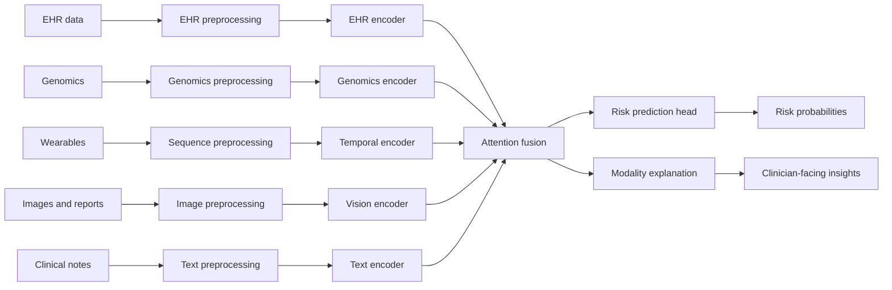

# Architecture

The system follows a high-level multimodal pipeline: ingestion, modality-specific preprocessing, feature extraction, attention-based fusion, prediction, and explanation.

## Missing Data Strategy

Every patient record includes a modality mask. The fusion layer uses this mask to ignore missing branches instead of assuming all inputs are present. This supports real clinical data, where patients may lack genomics, wearable streams, imaging, or free-text notes.
