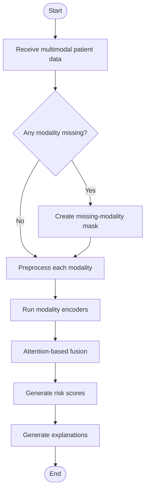

# Activity Diagram

```mermaid
flowchart TD
  Start(["Start"]) --> Input["Receive multimodal patient data"]
  Input --> Check{"Any modality missing?"}
  Check -->|Yes| Mask["Create missing-modality mask"]
  Check -->|No| Preprocess["Preprocess each modality"]
  Mask --> Preprocess
  Preprocess --> Encode["Run modality encoders"]
  Encode --> Fuse["Attention-based fusion"]
  Fuse --> Predict["Generate risk scores"]
  Predict --> Explain["Generate explanations"]
  Explain --> End(["End"])
```
