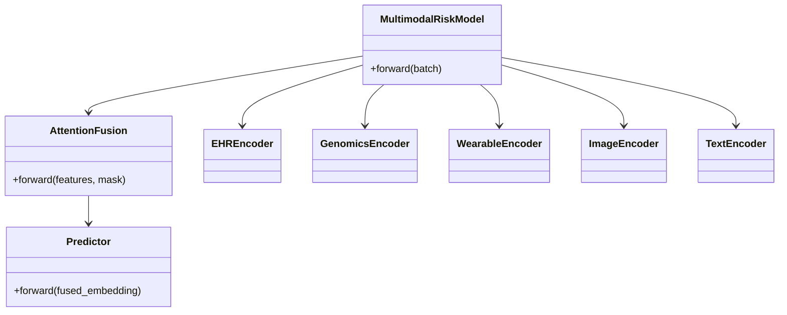

# Class Diagram

```mermaid
classDiagram
  class MultimodalRiskModel {
    +forward(batch)
  }
  class AttentionFusion {
    +forward(features, mask)
  }
  class Predictor {
    +forward(fused_embedding)
  }
  class EHREncoder
  class GenomicsEncoder
  class WearableEncoder
  class ImageEncoder
  class TextEncoder

  MultimodalRiskModel --> EHREncoder
  MultimodalRiskModel --> GenomicsEncoder
  MultimodalRiskModel --> WearableEncoder
  MultimodalRiskModel --> ImageEncoder
  MultimodalRiskModel --> TextEncoder
  MultimodalRiskModel --> AttentionFusion
  AttentionFusion --> Predictor
```
