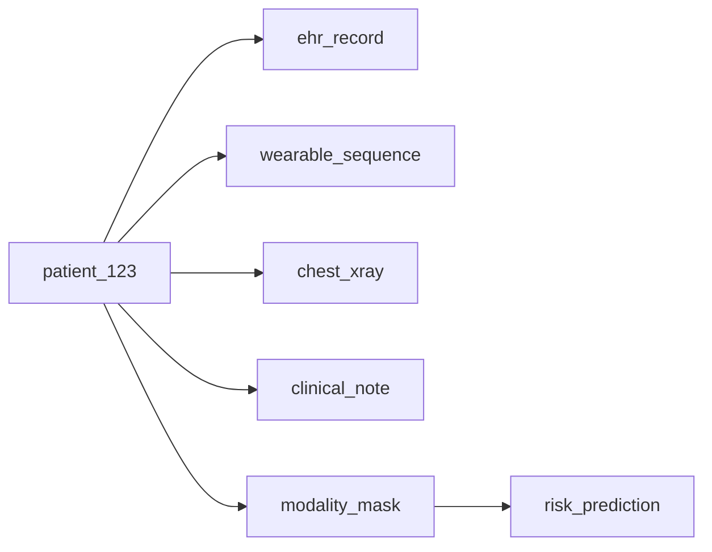

# Object Diagram

```mermaid
flowchart LR
  Patient123["patient_123"] --> EHRObj["ehr_record"]
  Patient123 --> WearObj["wearable_sequence"]
  Patient123 --> ImageObj["chest_xray"]
  Patient123 --> TextObj["clinical_note"]
  Patient123 --> MaskObj["modality_mask"]
  MaskObj --> PredictionObj["risk_prediction"]
```
