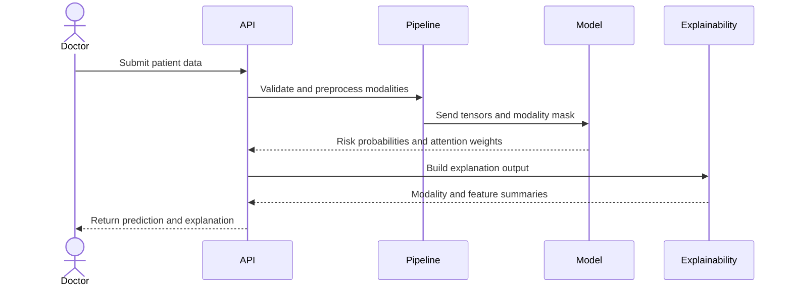

# Sequence Diagram

```mermaid
sequenceDiagram
  actor Doctor
  participant API
  participant Pipeline
  participant Model
  participant Explainability

  Doctor->>API: Submit patient data
  API->>Pipeline: Validate and preprocess modalities
  Pipeline->>Model: Send tensors and modality mask
  Model-->>API: Risk probabilities and attention weights
  API->>Explainability: Build explanation output
  Explainability-->>API: Modality and feature summaries
  API-->>Doctor: Return prediction and explanation
```
