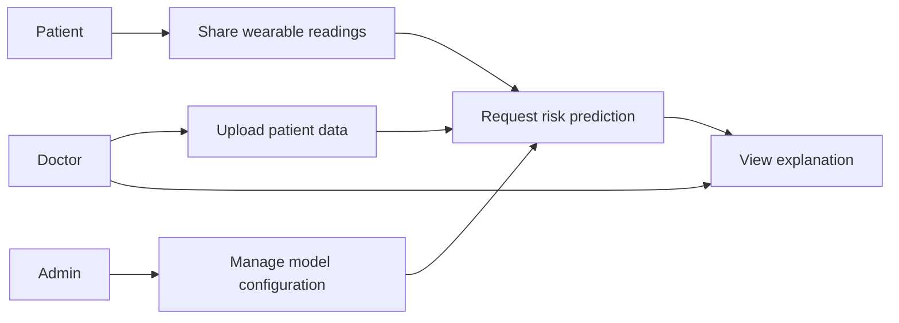

# Use Case Diagram

```mermaid
flowchart LR
  Doctor["Doctor"] --> Upload["Upload patient data"]
  Patient["Patient"] --> Wearable["Share wearable readings"]
  Admin["Admin"] --> Config["Manage model configuration"]
  Upload --> Predict["Request risk prediction"]
  Wearable --> Predict
  Config --> Predict
  Predict --> Explain["View explanation"]
  Doctor --> Explain
```
